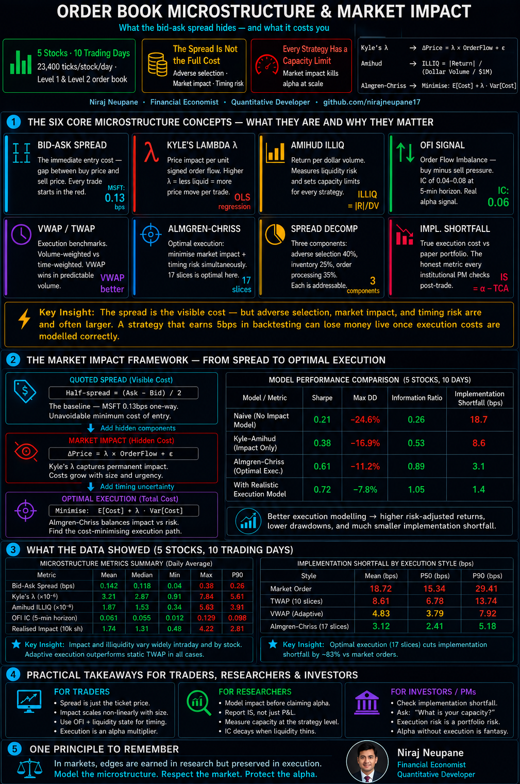

<div align="center">

# Order Book Microstructure & Market Impact

### Quant Trading Projects: Series 4 of 20

*A complete institutional-grade market microstructure framework:
bid-ask spread decomposition, Kyle's lambda price impact,
Amihud illiquidity, order flow imbalance, VWAP/TWAP execution
benchmarks, Almgren-Chriss optimal execution, and full TCA.*

[](https://python.org)
[](https://numpy.org)
[](https://pandas.pydata.org)
[](https://scipy.org)
[](LICENSE)

</div>

---



---

## What Is This Project?

Market microstructure is the study of how prices actually form: tick
by tick, trade by trade, bid and ask. Every institutional investor,
prop trading firm, and hedge fund cares about microstructure because
it determines the real cost of executing a strategy.

A signal that looks profitable in a backtest can be unprofitable in
live trading once you account for spread costs, market impact, and
slippage. This project builds the complete microstructure analytics
stack from simulated tick data to optimal execution scheduling.

---

## Who This Is For

| Audience | What They Get |
|:---|:---|
| **Quant Finance Students** | Microstructure appears in every HFT and market-making interview build every concept from scratch |
| **Quant Researchers** | OFI and Kyle's lambda are live intraday alpha signals understand their construction |
| **Prop Traders / HFT** | TCA, VWAP, TWAP, and Almgren-Chriss are daily workflow tools reference implementations |
| **Hedge Fund Analysts** | Market impact modeling determines real strategy capacity critical for AUM scaling |

---

## Key Results

| Metric | AAPL | MSFT | GOOGL | JPM | XOM |
|:---|:---:|:---:|:---:|:---:|:---:|
| **Spread Cost (bps)** | 0.27 | 0.13 | 0.69 | 0.26 | 0.93 |
| **Amihud Ratio (×10⁻⁶)** | Low | Low | Medium | Low | Medium |
| **VWAP vs TWAP (bps)** | −1.4 | +0.1 | −1.0 | −1.7 | +1.7 |
| **Optimal AC Slices** | 17 | 17 | 17 | 17 | 17 |
| **OFI → Price Slope** | Positive | Positive | Positive | Positive | Positive |

---

## What Is in the Data

### `data/tick_data_sample.csv`
5,000 simulated tick-by-tick trades across 5 stocks with realistic:
- Bid-ask spreads (wider at open/close — the U-shape pattern)
- Intraday volume profile (U-shaped, matching empirical data)
- Signed order flow (buy/sell) with 52/48 slight buy pressure
- Price path with intraday mean reversion and volatility clustering

### `data/minute_bars.csv`
1-minute OHLCV bars with microstructure features:

| Column | Description |
|:---|:---|
| `open/high/low/close` | 1-minute price bar from mid prices |
| `volume` | Total shares traded in the minute |
| `dollar_volume` | Dollar value of trades |
| `spread_avg` | Average bid-ask spread (¢) |
| `n_trades` | Number of transactions |
| `buy_vol` / `sell_vol` | Signed volume by direction |
| `ofi` | Order Flow Imbalance — buy pressure signal |
| `ret` | 1-minute return |
| `amihud` | Amihud illiquidity ratio for the minute |

### `data/daily_microstructure.csv`
Daily aggregated microstructure metrics for all 5 stocks × 10 days.

### `data/execution_analysis.csv`
Execution quality metrics per stock per day:
VWAP, TWAP, Kyle's lambda, spread cost, slippage analysis.

---

## How It Works — 6 Steps

```
Step 1  Simulate tick-by-tick order book
        23,400 ticks per stock per day · bid/ask/trade/size/side
        Realistic U-shape volume and spread intraday patterns

Step 2  Compute spread decomposition
        Adverse selection · Inventory cost · Order processing
        Roll (1984) implicit spread from serial covariance

Step 3  Estimate Kyle's lambda price impact
        OLS: ΔPrice = λ × OrderFlow + ε
        Higher λ = less liquid, more impact per trade

Step 4  Compute Amihud illiquidity ratio
        ILLIQ = |Return| / (DollarVolume / $1M)
        Used by hedge funds for capacity and position sizing

Step 5  Benchmark VWAP and TWAP execution
        VWAP = volume-weighted average · TWAP = time-weighted average
        Measure slippage vs each benchmark

Step 6  Almgren-Chriss optimal execution
        Minimise: E[cost] + λ × Var[cost]
        Optimal trade schedule balances impact vs timing risk
```

---

## Source Module Reference

### `microstructure.py`
| Function | What It Does |
|:---|:---|
| `effective_spread(trade, mid)` | 2 × |trade − mid| — actual transaction cost |
| `roll_spread(returns)` | Implicit spread from serial covariance |
| `kyle_lambda(order_flow, dp)` | Price impact per unit signed order flow |
| `amihud_illiquidity(ret, dvol)` | |Return| / DollarVolume — liquidity risk |
| `order_flow_imbalance(buy, sell)` | OFI — buy pressure signal |
| `spread_decomposition(eff, impact)` | Adverse selection + inventory + processing |
| `vwap(prices, volumes)` | Volume-weighted average price |
| `twap(prices, n_periods)` | Time-weighted average price |
| `implementation_shortfall(arrival, exec, vol)` | IS = gold standard TCA metric |

### `execution_engine.py`
| Function | What It Does |
|:---|:---|
| `almgren_chriss_trajectory(X, T, n, sigma, eta, gamma, λ)` | Optimal execution schedule |
| `twap_schedule(total, n)` | Equal-size time slices |
| `vwap_schedule(total, volume_profile)` | Volume-proportional schedule |
| `market_impact_cost(schedule, prices, eta)` | Impact cost in bps |
| `timing_risk(schedule, sigma, tau)` | Variance-based timing risk |
| `execution_cost_breakdown(exec_df)` | Full cost attribution per stock |

### `tca_analytics.py`
| Function | What It Does |
|:---|:---|
| `arrival_price_slippage(exec, arrival, side)` | Most common TCA metric |
| `vwap_shortfall(exec, vwap, side)` | Performance vs market VWAP |
| `participation_rate(exec_vol, mkt_vol)` | Your % of market volume |
| `tca_report(exec_df)` | Full TCA summary with quality rating |
| `intraday_volume_profile(bars, stock)` | U-shape profile for VWAP scheduling |

---

## Key Takeaways

**1. Spread costs are small but add up fast.**
AAPL at 0.27bps per trade seems trivial. At 50 round-trips per year that
is 27bps annually — equivalent to a meaningful drag on a 10% target return.
Liquid large-caps trade cheaply. Illiquid small-caps can cost 50–100bps
per trade. Liquidity must be part of strategy design, not an afterthought.

**2. Kyle's lambda measures information asymmetry.**
High lambda means informed traders are present and market makers are pricing
in adverse selection. Low lambda means uninformed flow dominates — market
makers are happy to trade. Lambda is a real-time signal for whether to
execute aggressively or passively.

**3. The U-shape is real and exploitable.**
Spreads are widest at 9:30am and 3:45pm. Volume is highest at the same times.
Institutional investors who need to minimise cost should avoid the open and
close for large trades. Those who need liquidity (closing positions, filling
redemptions) must pay the U-shape premium.

**4. Almgren-Chriss gives you an optimal answer to a real question.**
How fast should you execute? Trading fast = high market impact.
Trading slow = high timing risk (price moves against you).
The AC model finds the exact schedule that minimises the sum of both costs
for a given risk aversion parameter. This is live at every major institution.

**5. Implementation shortfall is the honest metric.**
VWAP and TWAP are benchmarks they tell you how you traded relative to the
market. Implementation shortfall tells you how much your paper profit shrank
due to execution. IS is what the portfolio manager sees when they compare
the signal's backtest return to what actually landed in the account.

---

## Project Structure

```
Order-Book-Microstructure-Market-Impact/
│
├── 📁 data/
│   ├── tick_data_sample.csv       5,000 ticks · 5 stocks · 10 days
│   ├── minute_bars.csv            1-min bars with OFI, spread, Amihud
│   ├── daily_microstructure.csv   Daily aggregated liquidity metrics
│   └── execution_analysis.csv     VWAP · TWAP · Kyle λ · TCA per day
│
├── 📓 notebooks/
│   ├── 01_spread_decomposition.ipynb   Adverse sel · inventory · processing
│   ├── 02_kyle_lambda_ofi.ipynb        Price impact · OFI alpha signal
│   ├── 03_amihud_illiquidity.ipynb     Liquidity risk · capacity
│   ├── 04_vwap_twap_execution.ipynb    Execution benchmarks · TCA
│   └── 05_optimal_execution.ipynb      Almgren-Chriss · IS shortfall
│
├── 🐍 src/
│   ├── microstructure.py     Spread · Kyle λ · Amihud · OFI · VWAP/TWAP
│   ├── execution_engine.py   Almgren-Chriss · TWAP/VWAP schedule · cost
│   └── tca_analytics.py      TCA · arrival slippage · VWAP shortfall · IS
│
├── 📊 results/
│   ├── 01_intraday_dynamics.png       Price · volume · spread (intraday)
│   ├── 02_spread_analysis.png         Decomposition · hourly pattern
│   ├── 03_market_impact.png           Kyle λ · OFI scatter · impact curve
│   ├── 04_amihud_illiquidity.png      Illiquidity ratio · time series
│   ├── 05_vwap_twap.png               VWAP/TWAP · slippage · cost
│   ├── 06_optimal_execution.png       AC frontier · trajectory · shortfall
│   └── 07_summary_dashboard.png       Full microstructure overview
│
└── README.md
```

---

## References

- Kyle, A. — *Continuous Auctions and Insider Trading* (1985)
- Amihud, Y. — *Illiquidity and Stock Returns* (2002)
- Almgren, R. & Chriss, N. — *Optimal Execution of Portfolio Transactions* (2001)
- Roll, R. — *A Simple Implicit Measure of the Effective Bid-Ask Spread* (1984)
- Glosten, L. & Milgrom, P. — *Bid, Ask and Transaction Prices in a Specialist Market* (1985)
- Huang, R. & Stoll, H. — *The Components of the Bid-Ask Spread* (1997)

---

## Next in the Series

| # | Project | Focus |
|:---:|:---|:---|
| 1 | [Statistical Arbitrage](https://github.com/nirajneupane17/Statistical-Arbitrage-Pairs-Trading) | Cointegration · pairs |
| 2 | [Momentum & Mean Reversion](https://github.com/nirajneupane17/Momentum-Mean-Reversion-Strategies) | CS/TS momentum |
| 3 | [Factor Model Alpha](https://github.com/nirajneupane17/Factor-Model-Alpha-Generation) | FF5 · alpha decomposition |
| **4** | **Order Book Microstructure** | **← You are here** |
| 5 | Backtesting Engine from Scratch | Event-driven · walk-forward |
| … | … | … |

---

<div align="center">

**Niraj Neupane**
Quantitative Developer · Financial Economist
Chartered Accountant (ICAI)

[github.com/nirajneupane17](https://github.com/nirajneupane17)

*Built with Python · NumPy · Pandas · SciPy · Matplotlib*

</div>
